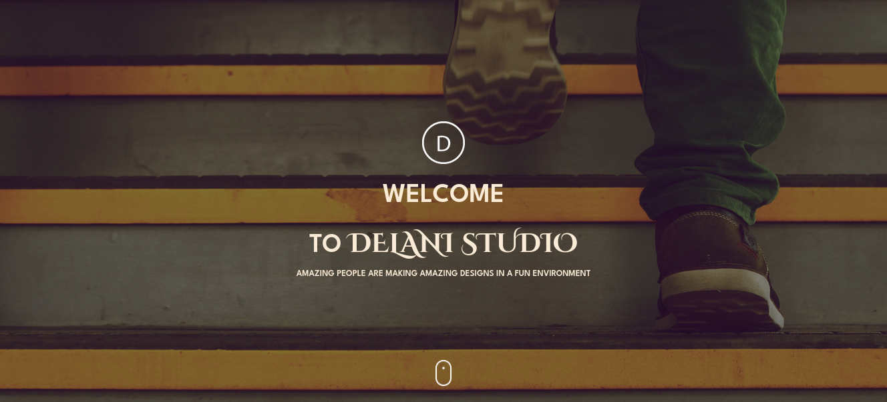

# Delani_Studio

## Table of Content

- [Description](#description)
- [Screenshot](#screenshot)
- [Installation](#install-requirements)
- [Technology Used](#technology)
- [License](#license)
- [Authors Info](#authors-Info)

## Description

This landing page represents a prime example of a studio website, built using the latest HTML, CSS, and JavaScript technologies. The page has been meticulously designed to provide an immersive and visually appealing experience for visitors, with sophisticated design elements and advanced programming techniques seamlessly integrated to achieve a polished and professional look.

## Screenshot

## Install Requirements

- Computer

- Internet Access

- Git

- Terminal

## Installation

On your computer open terminal and run:

    git clone https://github.com/qurriahSam/delaniStudio.git

[Go Back to the top](#Deleni_Studio)

## Technology

- Semantic HTML5 Markup - Has been used to build the structure of the page.

- CSS Custom properties - Has been used to style the landing page.

- JavaScript - Has been used to create the business logic.

- Bootstrap - Has been used for styling the navbar and other elements on the landingpage.

- JQuery - Has been used for javascript Functionality

## Links

- Live Site URL: [Delani-Studio](https://qurriahsam.github.io/delaniStudio/)

[Go Back to the top](#Deleni_Studio)

## License

[MIT](./LICENSE) License.

[Go Back to the top](#Deleni_Studio)

## Authors Info

Linked - [Sam Kuria](https://www.linkedin.com/in/sam-kuria-0904b01a1)

[Go Back to the top](#Deleni_Studio)
